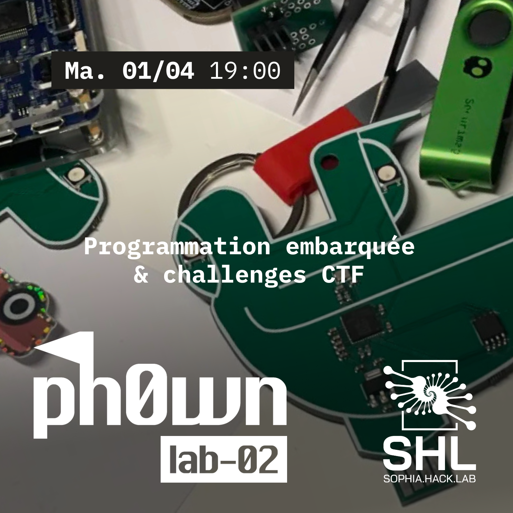

# Ph0wn Labs 02



:tada: Welcome to **Ph0wn Labs 02**! 

1. [Installation of Pico SDK for Raspberry Pico](#install-pico-sdk)
2. Get a *Ph0wn Pico le Croco* board
3. Repair the :car: of *Pico le Croco* :crocodile: and [solve "Pico PCB 2"](#ph0wn-ctf-challenge) at https://ph0wn.shl.contact/
4. [Implement, flash and share your best April Fools' Day program for Raspberry Pico](#april-1st)

> At the end of the lab, please hand over the board to Paul, Nicolas or myself.
> You can keep it only if you *swear* you'll be using it, otherwise, we need it for future labs, thanks!

:newspaper: **Ph0wn News**

- https://ph0wn.org
- Discord: https://discord.gg/ddspM9deeu
- :date: Next edition: **March 13-14 2026**
- Want to contribute :pencil: or sponsor :dollar: ? Contact @BetterCallPaul, @BlackB0x or @cryptax.


## :books: Reference documentation

- [Getting started with Pico](https://datasheets.raspberrypi.com/pico/getting-started-with-pico.pdf)
- [Raspberry Pi Pico series C/C++ SDK](https://datasheets.raspberrypi.com/pico/raspberry-pi-pico-c-sdk.pdf)
- [Pico-SDK](https://github.com/raspberrypi/pico-sdk)
- [Hardware design with RP2040](https://datasheets.raspberrypi.com/rp2040/hardware-design-with-rp2040.pdf)
- [Ph0wn SHL CTF](https://ph0wn.shl.contact)

## Install Pico SDK

This will install the necessary packages (apt-get...) and clone the SDK as a sub-directory of `~/softs`:

```
cd softs
wget https://raw.githubusercontent.com/raspberrypi/pico-setup/master/pico_setup.sh`
chmod u+x pico_setup.h
./pico_setup.sh
export PICO_SDK_PATH=~/softs/pico/pico-sdk
```

## Ph0wn CTF challenge

- Get a board "Pico le Croco"
- Connect to [Ph0wn SHL CTF](https://ph0wn.shl.contact). Create an account if necessary.
- Look for challenge "Pico PCB 2". Solve it!

> If you already have a CTF environment, make sure you have a disassembler such as [Ghidra](https://github.com/NationalSecurityAgency/ghidra/releases).
> If you have no CTF environment, you *can* just install Ghidra, but you'll be better off installing [Exegol](https://exegol.readthedocs.io/en/latest/) because it contains many useful tools.

**Spoiler**: [challenge write-up](https://github.com/ph0wn/writeups/blob/master/2024/pico-pcb/solution/stage2/writeup.md). Wait till the end of the lab! :wink:

## April 1st

Time to express your creativity!
Implement an app on the board. We suggest something about April's Fool Day? :tada:

1. [Write your code and compile](#implement-your-own-program-on-rp2040)
2. [Flash it](#flash-the-firmware)
3. Enjoy :smiley:

### Implement your own program on RP2040

1. Write `yourprog.c`
2. Write `CMakeLists.txt`
3. Copy `pico_sdk_import.cmake` of `pico-sdk/external` (follow https://datasheets.raspberrypi.com/pico/getting-started-
with-pico.pdf page 38)

```
mkdir build
cd build
export PICO_SDK_PATH=~/softs/pico/pico-sdk
cmake ..
make
```

- [Ref page 361](https://0xinfection.github.io/reversing/reversing-for-everyone.pdf)
- [Ref page 15](https://datasheets.raspberrypi.com/pico/getting-started-with-pico.pdf)

### PCB Pico le Croco :crocodile: Ph0wn 2024

- Schematics [PDF](./pcb-schematics.pdf)
- LEDs of ph0wn PCB Pico le Croco: https://github.com/MrYsLab/NeoPixelConnect

#### Boot modes

To flash the RP2040, we need to be in **BOOTSEL** mode. 
There is no button to reach that mode on ph0wn's simple PCB.
We use a *trick* mentioned in the [Hardware design with RP2040](https://datasheets.raspberrypi.com/rp2040/hardware-design-with-rp2040.pdf). It consists in preventing access to the Flash. For that, on ph0wn's board, connect pin 1 and 4 (cf image), then insert the board, wait 2-3 seconds so that it boots, and let the connection go.

{ width=50% }

> if we simply place a jumper wire between the pins of J2 [USB_BOOT and GND], we pull QSPI_SS pin to ground, and if the device is then subsequently reset (e.g by toggling the RUN pin), RP2040 will restart in BOOTSEL mode instead of attempting to run the contents of the flash

**Which mode am I in?**

Normal boot mode:

```
$ lsusb
Bus 002 Device 005: ID 2e8a:000a Raspberry Pi Pico
```

BOOTSEL mode: 
```
$ lsusb
Bus 002 Device 005: ID 2e8a:000a Raspberry Pi RP2 Boot
```

#### Flash the firmware

- Pre-requisite: Install PICO-SDK
- Boot the device in BOOTSEL mode
- `sudo $PICO_SDK_PATH/../picotool/build/picotool load ./firmware/firmware.0.15.uf2`
- Rebooter: `sudo $PICO_SDK_PATH/../picotool/build/picotool reboot`

#### Dump the firmware

- Pre-requisite: Install PICO-SDK
- Boot the device in BOOTSEL mode
- `sudo $PICO_SDK_PATH/../picotool/build/picotool save firmware.uf2`

#### Example

I implemented my own attempt in `./april-1`. You can use that as template.

- Flash it: `sudo $PICO_SDK_PATH/../picotool/build/picotool load ./firmware/fool.uf2`
- Reboot the device
- Connect on the serial port: e.g. `picocom -b 115200 /dev/ttyACM0`.

Enjoy :crocodile:


